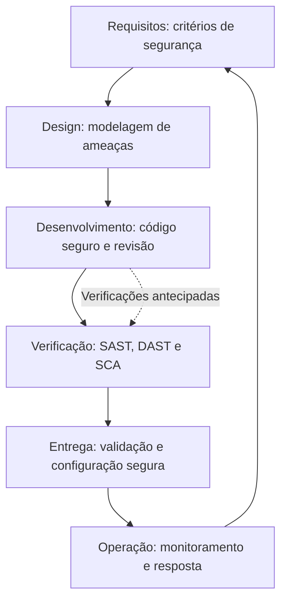
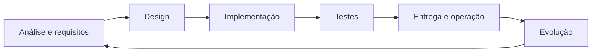
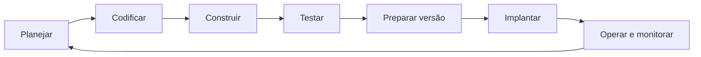
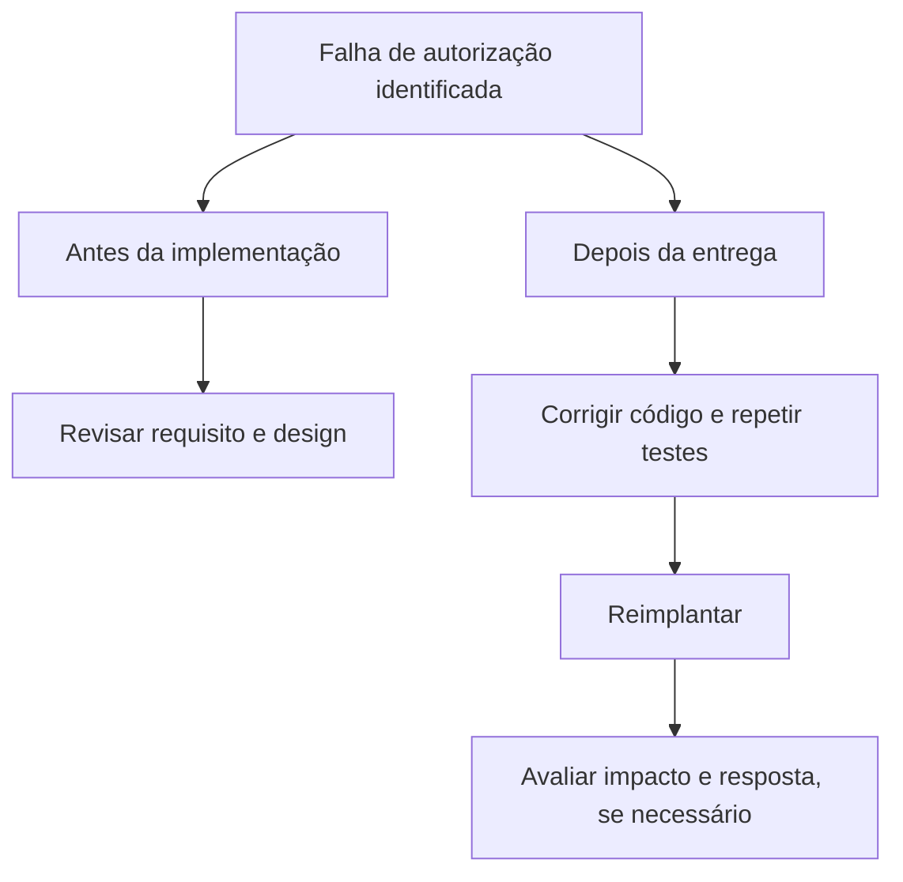

# Ciclo de desenvolvimento de software seguro — SSDLC

- Criado em: 2026-09-11
- Última pesquisa: 2026-09-11

## Conceito
SDLC é o ciclo de vida do desenvolvimento de software. SSDLC explicita a integração de segurança ao longo desse ciclo. DevSecOps aproxima desenvolvimento, segurança e operação com colaboração, automação e retorno contínuo dos resultados. Não há uma única sequência obrigatória de ferramentas ou etapas. [NIST NCCoE — Modelo de referência DevSecOps](https://pages.nist.gov/nccoe-devsecops/notational-reference-model.html).

## Segurança ao longo das etapas
Síntese didática dos controles ao longo do ciclo. Os controles associados são exemplos; não pertencem exclusivamente à etapa em que aparecem.

O retorno à análise faz do desenvolvimento um ciclo: mudanças, falhas e novas necessidades alimentam a próxima versão.

## Relação com o fluxo DevSecOps
Esta representação organiza o fluxo por atividades. A escolha de produtos depende do ambiente.

Segurança acompanha o fluxo inteiro; a pipeline executa parte das verificações, mas não substitui decisões de arquitetura e responsabilidade das equipes. [NIST NCCoE — Modelo de referência DevSecOps](https://pages.nist.gov/nccoe-devsecops/notational-reference-model.html).

## Por que antecipar problemas?
Encontrar uma falha de design antes da implementação permite tratar sua causa antes que se espalhe. A modelagem antecipada ajuda nesse trabalho. [OWASP — Modelagem de ameaças](https://cheatsheetseries.owasp.org/cheatsheets/Threat_Modeling_Cheat_Sheet.html).

Exemplo ilustrativo de retrabalho, sem escala numérica:

A representação acima explica possíveis atividades adicionais; não estima custos nem prova que toda correção tardia será mais cara. Multiplicadores de custo exigem evidências e contexto antes de serem usados como regra geral.

## Conexões
- [[DevOps, DevSecOps e AppSec]]
- [[Integração, entrega e implantação contínuas]]
- [[Requisitos de segurança]]
- [[Modelagem de ameaças e STRIDE]]
- [[Verificações de segurança — SAST, DAST e SCA]]
- [[Hardening e operação segura]]

## Revisão técnica
2026-09-11 — Distinção entre SDLC e SSDLC; inclusão de operação e retorno contínuo; controles apresentados como recorrentes. A representação de retrabalho é qualitativa e não fornece evidência quantitativa de custos.

## Referências
- [NIST NCCoE — Modelo de referência DevSecOps](https://pages.nist.gov/nccoe-devsecops/notational-reference-model.html) — consultado em 2026-09-11.
- [OWASP — Modelagem de ameaças](https://cheatsheetseries.owasp.org/cheatsheets/Threat_Modeling_Cheat_Sheet.html) — consultado em 2026-09-11.

[[Índice — DevSecOps|Voltar ao índice]]
