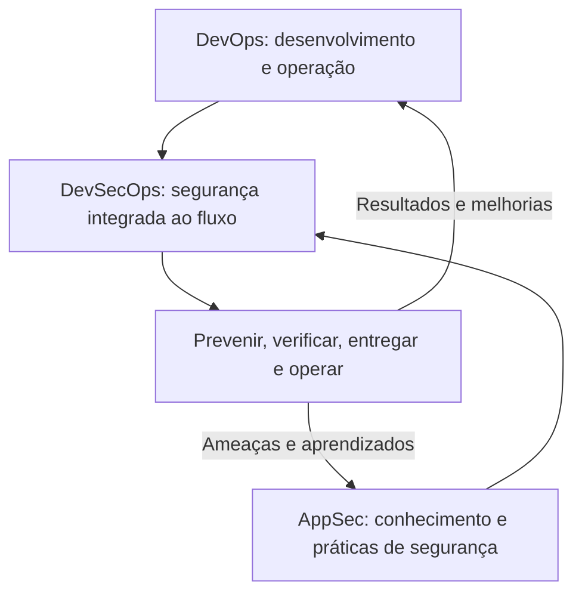

# DevOps, DevSecOps e AppSec

- Criado em: 2026-09-15
- Última pesquisa: 2026-09-15

## Conceitos e diferenças
| Conceito | Foco | Exemplos |
|---|---|---|
| DevOps | Colaboração entre desenvolvimento e operação, com práticas e automação para entregar e operar software com confiabilidade | Integração contínua, configuração automatizada e monitoramento |
| DevSecOps | Segurança integrada às responsabilidades e ao fluxo DevOps durante todo o ciclo | Requisitos de segurança, verificações automatizadas e resposta a falhas |
| AppSec | Disciplina de segurança de aplicações | Design seguro, revisão de código, modelagem de ameaças e tratamento de vulnerabilidades |

DevOps combina cultura, práticas e ferramentas; não é sinônimo de uma pipeline nem exclui segurança. [AWS — DevOps](https://aws.amazon.com/devops/what-is-devops/). DevSecOps explicita a colaboração com segurança desde o início, além de scanners e bloqueios. [AWS — DevSecOps](https://aws.amazon.com/what-is/devsecops/). AppSec reúne atividades de proteção das aplicações ao longo do ciclo. [AWS — Application Security](https://aws.amazon.com/what-is/application-security/).

## Como se relacionam
Síntese didática das relações entre os conceitos:

A relação não determina organogramas: práticas de AppSec podem ser aplicadas em diferentes modelos de desenvolvimento. Títulos profissionais não estabelecem uma divisão universal de tarefas.

## Atividades e colaboração
Exemplo de distribuição possível, sem exclusividade entre cargos:
| Atividade | Colaboração possível |
|---|---|
| Requisitos e modelagem de ameaças | Produto, desenvolvimento, arquitetura, AppSec e operação |
| Automação de verificações | Desenvolvimento, plataforma, DevOps/DevSecOps e AppSec |
| Triagem e correção | Especialistas apoiam a análise; responsáveis pelo código implementam e verificam correções |
| Capacitação | AppSec apoia a equipe e os Security Champions |
| Operação segura | Operação e desenvolvimento colaboram com segurança |

Automação deve produzir informação útil e reduzir esforço recorrente. Bloquear uma entrega é um controle possível, não a finalidade do trabalho de segurança. Os critérios precisam considerar risco e processo de correção.

## Relação com os estudos
- [[Ciclo de desenvolvimento de software seguro — SSDLC]] — segurança ao longo do ciclo.
- [[Integração, entrega e implantação contínuas]] — automação e retorno rápido.
- [[Security Champions]] — colaboração dentro das equipes.
- [[Verificações de segurança — SAST, DAST e SCA]] — ferramentas e interpretação.

## Revisão técnica
2026-09-15 — Separados conceitos e cargos. DevSecOps não foi reduzido a ferramentas na pipeline, nem apresentado como subconjunto organizacional obrigatório de AppSec. A tabela de responsabilidades é ilustrativa.

## Referências
- [AWS — DevOps](https://aws.amazon.com/devops/what-is-devops/) — consultado em 2026-09-15.
- [AWS — DevSecOps](https://aws.amazon.com/what-is/devsecops/) — consultado em 2026-09-15.
- [AWS — Application Security](https://aws.amazon.com/what-is/application-security/) — consultado em 2026-09-15.

[[Índice — DevSecOps|Voltar ao índice]]
