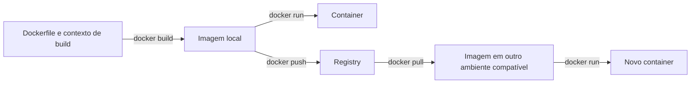

# Docker — imagens, containers e Dockerfile

- Criado em: 2026-10-07
- Última pesquisa: 2026-10-07
- Escopo: fundamentos para aplicações e ferramentas em pipelines; exemplos didáticos não executados.

## Conceitos

Docker permite construir imagens e executar containers. Uma **imagem** é um modelo que reúne arquivos, dependências e configurações; um **container** é uma instância criada a partir dessa imagem. O **Dockerfile** contém as instruções para construir a imagem. Um **registry**, como Docker Hub, armazena e distribui imagens. Publicar uma imagem não significa implantar a aplicação. [Docker — visão geral](https://docs.docker.com/get-started/docker-overview/).

O empacotamento reduz diferenças entre ambientes, mas não garante funcionamento em qualquer máquina. Containers compartilham o kernel do ambiente de execução; compatibilidade de sistema operacional e arquitetura continua necessária. Uma imagem para uma plataforma pode exigir emulação ou uma variante apropriada para outra. Configuração, volumes, rede e serviços externos também precisam estar disponíveis. [Docker — builds multiplataforma](https://docs.docker.com/build/building/multi-platform/).



O diagrama distingue construção, distribuição e execução.

## Instruções do Dockerfile

| Instrução | Função |
|---|---|
| `FROM` | Define a imagem base de um estágio |
| `WORKDIR` | Define o diretório para instruções seguintes; cria-o se necessário |
| `COPY` | Copia arquivos do contexto de build para a imagem |
| `RUN` | Executa comandos durante a construção |
| `EXPOSE` | Documenta a porta utilizada; não a publica no host |
| `USER` | Define o usuário para instruções seguintes e execução |
| `CMD` | Define o comando padrão ao iniciar o container; pode ser substituído |

`RUN` não significa necessariamente Bash: o shell depende da imagem e da configuração. `WORKDIR` não serve apenas ao modo interativo. [Docker — referência do Dockerfile](https://docs.docker.com/reference/dockerfile/).

### Exemplo — Dockerfile para um serviço Node.js

**Objetivo:** empacotar um serviço existente e executá-lo sem usuário root. Este modelo pressupõe `server.js`, `package.json` e `package-lock.json` compatíveis, sem etapa de compilação, e uma imagem oficial Linux de Node.js que contenha o usuário `node`. [Node.js — imagens Docker e usuário sem privilégios](https://github.com/nodejs/docker-node/blob/main/docs/BestPractices.md).

```dockerfile
# Informar uma referência de imagem oficial compatível ao construir.
ARG NODE_IMAGE
FROM ${NODE_IMAGE}
WORKDIR /app

# Instalar conforme o lockfile antes de copiar o restante do código.
COPY package.json package-lock.json ./
RUN npm ci --omit=dev

COPY --chown=node:node . .
USER node
EXPOSE 3000
CMD ["node", "server.js"]
```

`npm ci` exige lockfile e falha se ele não corresponder a `package.json`; `--omit=dev` não instala dependências de desenvolvimento no disco. Aplicações que precisam delas para compilar exigem outra etapa de build. [npm — ci](https://docs.npmjs.com/cli/v11/commands/npm-ci/).

**Antes do build:** criar `.dockerignore` com `node_modules`, `.git`, `.env` e outros arquivos que não devam entrar na imagem. Definir `NODE_IMAGE` com uma referência verificada, adequada à aplicação; para reprodutibilidade, considerar digest. `NODE_IMAGE` não tem valor padrão: o modelo não constrói sem esse argumento. [Docker — boas práticas](https://docs.docker.com/build/building/best-practices/).

**Como conferir:** após construir com `docker build --build-arg NODE_IMAGE=REFERENCIA_VERIFICADA -t minha-app:teste .`, executar em ambiente de teste, verificar o usuário efetivo e consultar um endpoint conhecido. Se o serviço escutar em `0.0.0.0:3000`, publicar com `-p 127.0.0.1:8080:3000` permite acesso local pela porta 8080. Verificar inicialização e permissões de escrita; `EXPOSE` não configura o servidor nem publica a porta. [Docker — publicação de portas](https://docs.docker.com/get-started/docker-concepts/running-containers/publishing-ports/).

**Limites:** `REFERENCIA_VERIFICADA` é um placeholder a substituir. O código da aplicação não está incluído e o exemplo não foi executado. Aplicações com build, dependências nativas ou arquivos gravados em execução precisam de adaptação.

Para uma aplicação real, avaliar versão e digest da base, atualização periódica, `.dockerignore`, dependências reprodutíveis e execução com usuário sem privilégios quando possível. Fixar um digest melhora a previsibilidade, mas exige atualizar a referência para receber correções. A seleção concreta depende do projeto. [Docker — boas práticas](https://docs.docker.com/build/building/best-practices/).

## Comandos básicos

Os comandos abaixo são referências de sintaxe, não uma sequência pronta de laboratório. `IMAGEM` representa uma imagem existente; `CONTAINER` representa nome ou ID de container.

| Comando | Objetivo |
|---|---|
| `docker image pull IMAGEM` | Baixar uma imagem |
| `docker image ls` | Listar imagens locais |
| `docker run -it IMAGEM COMANDO` | Criar e iniciar container com entrada interativa e terminal |
| `docker run -d --name exemplo IMAGEM` | Criar e iniciar em segundo plano; o processo principal precisa permanecer ativo |
| `docker ps` | Listar containers em execução |
| `docker ps -a` | Incluir containers parados |
| `docker stop CONTAINER` | Parar um container |
| `docker rm CONTAINER` | Remover um container parado |
| `docker image rm IMAGEM` | Remover uma imagem local, respeitando dependências |
| `docker build -t minha-app:teste .` | Construir imagem usando o contexto do diretório atual |
| `docker image tag minha-app:teste USUARIO/minha-app:teste` | Criar referência com namespace para publicação |
| `docker login` | Autenticar no registry; sem endereço, utiliza o padrão |
| `docker image push USUARIO/minha-app:teste` | Enviar a imagem para um namespace no qual haja permissão |
| `docker --help` | Consultar ajuda; subcomandos também aceitam `--help` |

`stop` e `rm` atuam sobre containers, não sobre imagens. O ponto final em `build` define o contexto; não faz parte da tag. Publicar exige nome adequado ao registry, autenticação e autorização. [Docker — visão geral e comandos](https://docs.docker.com/get-started/docker-overview/).

## Portas e acesso local

Em `docker run -p 8080:80 IMAGEM`, `8080` é a porta do host e `80` é a porta do container. A aplicação deve estar escutando na porta e interface apropriadas dentro do container. `EXPOSE 80` sozinho não disponibiliza o serviço no host. [Docker — publicação de portas](https://docs.docker.com/get-started/docker-concepts/running-containers/publishing-ports/).

Para um exemplo destinado apenas ao acesso local, a publicação pode ser `-p 127.0.0.1:8080:80`. Sem IP explícito, a publicação normalmente abrange todas as interfaces do host. Publicação de portas é diferente de **bind mount**, que dá acesso a arquivos ou diretórios do host. [Docker — publicação de portas](https://docs.docker.com/get-started/docker-concepts/running-containers/publishing-ports/).

## Exemplo completo — programa Python em uma imagem

**Objetivo:** empacotar um programa que imprime uma mensagem e termina. Requer Docker com suporte a containers Linux, acesso à imagem base e os dois arquivos abaixo no mesmo diretório. O arquivo de construção se chama `Dockerfile`, sem extensão.

`hi.py`:

```python
print("Hi :)")
```

`Dockerfile`:

```dockerfile
FROM python:3.12
WORKDIR /app
COPY hi.py .
CMD ["python", "hi.py"]
```

`FROM` fornece Python; `WORKDIR` define `/app`; `COPY` coloca o script nesse diretório. `CMD` define a execução ao iniciar o container, sem executar o programa durante o build. Não é necessário instalar bibliotecas adicionais para esse script. [Docker — Dockerfile](https://docs.docker.com/reference/dockerfile/).

No diretório dos arquivos, construir e executar:

```powershell
docker build -t hello-docker:teste .
docker run --rm hello-docker:teste
```

**Resultado esperado:** `Hi :)`. O programa termina depois do `print`, encerrando o container; não é um servidor e não precisa publicar portas. `--rm` remove o container ao encerrar, preservando a imagem. Sem essa opção, consultar containers encerrados com `docker ps -a`. Linhas `CACHED` no build indicam reutilização de etapas; não comprovam que todas foram refeitas. [Docker — execução](https://docs.docker.com/reference/cli/docker/container/run/), [cache de construção](https://docs.docker.com/build/cache/).

Para abrir um shell, substituir o comando padrão explicitamente:

```powershell
docker run --rm -it hello-docker:teste bash
```

Dentro dele, `pwd` deve mostrar `/app`, `ls` deve incluir `hi.py` e `python hi.py` deve imprimir a mensagem. Encerrar com `exit`. `-i` mantém a entrada aberta e `-t` aloca um terminal; `docker run -it hello-docker:teste` continua executando Python e termina, pois essas opções não substituem `CMD`. O shell exige que `bash` exista na imagem. [Docker — execução](https://docs.docker.com/reference/cli/docker/container/run/).

Para publicar, substituir `SEU_USUARIO` por um namespace do Docker Hub no qual haja permissão:

```powershell
docker tag hello-docker:teste SEU_USUARIO/hello-docker:teste
docker login
docker push SEU_USUARIO/hello-docker:teste
```

Após publicar, um ambiente compatível pode executar `docker run --rm SEU_USUARIO/hello-docker:teste`. Por padrão, `run` baixa a imagem se ela estiver ausente localmente; não consulta automaticamente uma versão nova de uma tag já presente. `--pull=always` solicita essa consulta antes de executar. [Docker — push](https://docs.docker.com/reference/cli/docker/image/push/), [execução e política de pull](https://docs.docker.com/reference/cli/docker/container/run/).

**Identidade e limites:** omitir a tag implica `latest`, um nome que pode apontar para outro conteúdo posteriormente. O digest identifica o conteúdo publicado; usar `USUARIO/IMAGEM@sha256:DIGEST_COMPLETO` exige substituir os placeholders pelo digest real. Fixá-lo exige atualização deliberada para receber correções. A base `python:3.12` também é uma tag mutável. Este Dockerfile não define `USER`; não demonstra execução sem privilégios nem hardening. Não confundir usuário root dentro do container com `--privileged`, opção distinta que amplia suas permissões. [Docker — digests](https://docs.docker.com/reference/cli/docker/image/pull/), [USER](https://docs.docker.com/reference/dockerfile/#user), [execução](https://docs.docker.com/reference/cli/docker/container/run/).

Os comandos desta seção são uma sequência de referência, não uma execução realizada durante a documentação. As evidências da aplicação concreta estão em [[Laboratório — Docker — construção, publicação e execução de imagem]].


## Uso em pipelines

Uma ferramenta de segurança pode ser distribuída em imagem, reduzindo a instalação manual de suas dependências no runner. Isso não elimina configuração, atualização da ferramenta, acesso ao código ou persistência de relatórios e dados. [[Ferramentas de segurança na pipeline]] explica os objetos de análise e, para Dependency-Check, a necessidade de persistir e atualizar os dados.

## Revisão técnica e limites

2026-10-07 — Acrescentado exemplo Python completo com construção, publicação, término do container, shell, cache e identidade por tag/digest. A execução pessoal registrada está separada no laboratório; os comandos ilustrativos não foram executados nesta documentação.

2026-10-07 — Desenvolvido modelo comentado de Dockerfile Node.js com pré-requisitos, usuário sem privilégios, instalação por lockfile e critérios de verificação. Fontes Docker, Node.js e npm citadas no exemplo; não houve execução.

2026-10-07 — Esclarecidas as diferenças entre imagem e container, os limites de portabilidade, `EXPOSE` e publicação de portas, remoção de imagens e containers e publicação com `push`. Fontes: documentação Docker citada acima.

Os exemplos são didáticos: não foi executado build, container ou deploy durante esta documentação. A prática pessoal e suas saídas estão registradas no laboratório vinculado. A configuração de um Dockerfile precisa ser adaptada e testada no projeto de aplicação.

Fontes consultadas em 2026-10-07, registradas em [[Referências DevSecOps]].

[[GitHub Actions — workflows, jobs e steps]] · [[Ferramentas de segurança na pipeline]]

[[Índice — DevSecOps|Voltar ao índice]]
