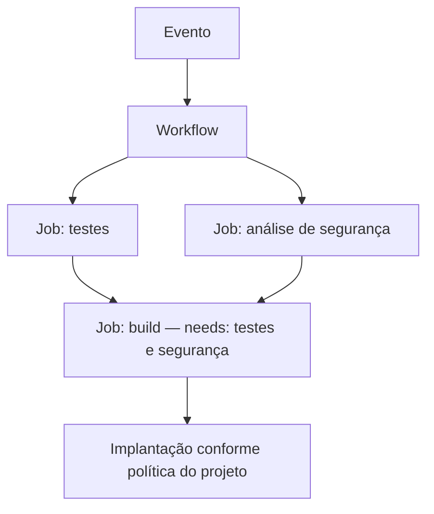

# GitHub Actions — workflows, jobs e steps

- Criado em: 2026-10-02
- Última pesquisa: 2026-10-07
- Escopo: GitHub.com; exemplos didáticos, sem execução registrada.

## Pergunta central

Como representar uma pipeline de automação no GitHub Actions?

## Conceitos

Uma pipeline organiza tarefas automatizadas e suas dependências. Pode construir, testar, analisar e implantar software, mas não precisa chegar à produção. No GitHub Actions, essa automação é descrita em workflows. Um repositório pode ter vários workflows, inclusive para tarefas administrativas. [GitHub — Workflows](https://docs.github.com/en/actions/concepts/workflows-and-actions/workflows).

| Elemento | Função |
|---|---|
| Workflow | Processo automatizado configurado em YAML |
| Evento | Gatilho definido em `on` |
| Job | Unidade de execução que agrupa steps |
| Runner | Máquina que executa o job |
| Step | Passo que executa comandos ou uma action |
| Action | Unidade reutilizável chamada com `uses` |

Os arquivos usam `.yml` ou `.yaml` e ficam em `.github/workflows/`, na raiz do repositório. A indentação expressa a estrutura. `name` identifica o workflow; `on` define eventos; `jobs` contém os jobs; `runs-on` seleciona o runner. [GitHub — Sintaxe](https://docs.github.com/en/actions/reference/workflows-and-actions/workflow-syntax).

## Exemplo mínimo comentado

Arquivo ilustrativo: `.github/workflows/hello.yml`.

```yaml
name: Exemplo de workflow
on:
  push:
    branches: [main]
  pull_request:
    branches: [main]
  workflow_dispatch:

permissions: {}

jobs:
  hello:
    runs-on: ubuntu-latest
    steps:
      - name: Mostrar mensagem
        shell: bash
        run: echo 'Hello world!'
```

O exemplo apenas imprime uma mensagem: não faz checkout, build, scan ou deploy. `permissions: {}` remove permissões do `GITHUB_TOKEN`, desnecessárias para esse comando. A política de permissões deve ser ajustada às tarefas reais. [GitHub — Permissões](https://docs.github.com/en/actions/reference/workflows-and-actions/workflow-syntax#permissions).

## Eventos e branches

| Evento | Aplicação |
|---|---|
| `push` | Mudanças enviadas ao repositório |
| `pull_request` | Atividades em solicitações de integração |
| `issues` | Atividades em issues |
| `workflow_dispatch` | Acionamento manual, inclusive pela interface |
| `schedule` | Execução periódica com cron |

No exemplo, `push.branches` filtra a branch que recebe o push; `pull_request.branches` filtra a branch de destino do PR. `main` é uma escolha do exemplo. Alguns eventos exigem que o arquivo exista na branch padrão; `workflow_dispatch` e `schedule` têm essa exigência. Consulte as regras do evento antes de configurar. [GitHub — Eventos](https://docs.github.com/en/actions/reference/workflows-and-actions/events-that-trigger-workflows).

## Dependências e falhas

Jobs sem dependências podem executar em paralelo, conforme disponibilidade e limites. `needs` estabelece dependências entre jobs. Por padrão, um job dependente aguarda sucesso dos jobs necessários; falha ou omissão pode impedir sua execução. Steps normalmente seguem a ordem declarada. Condições com `if` permitem controlar a execução. [GitHub — Jobs e steps](https://docs.github.com/en/actions/reference/workflows-and-actions/workflow-syntax#jobs).

Adaptação conceitual, sem configurar scanners específicos:



Um scan só funciona como critério de bloqueio quando seus resultados, códigos de saída e condições são tratados pelo fluxo. `continue-on-error: true` em um step permite que sua falha não faça o job falhar. Em uma análise DAST, essa configuração pode permitir prosseguir apesar de erro. Coletar evidências e bloquear uma entrega são decisões distintas. [GitHub — continue-on-error](https://docs.github.com/en/actions/reference/workflows-and-actions/workflow-syntax#jobsjob_idstepscontinue-on-error).

## Runners

O GitHub oferece runners Linux, Windows e macOS. Em runners próprios, a organização administra a infraestrutura, o ambiente e sua segurança. A escolha depende de recursos, conectividade, isolamento, custos e manutenção. [GitHub — Runners hospedados](https://docs.github.com/en/actions/concepts/runners/github-hosted-runners), [runners próprios](https://docs.github.com/en/actions/concepts/runners/self-hosted-runners).

Limites de execução e concorrência são diferentes de limites impostos por um registry ou serviço externo. Trocar o runner não garante resolver falhas de requisição. O diagnóstico deve considerar logs, conectividade e limites do serviço afetado. [GitHub — Limites](https://docs.github.com/en/actions/reference/limits).

## Actions e reutilização

Actions podem ser implementadas com JavaScript, container Docker ou composição de passos. Podem ser próprias ou de terceiros; publicação no Marketplace não é requisito para reutilização. Uma action executa dentro de um step; um workflow reutilizável, chamado com `workflow_call`, reutiliza um processo com jobs. [GitHub — Actions personalizadas](https://docs.github.com/en/actions/concepts/workflows-and-actions/custom-actions), [workflows reutilizáveis](https://docs.github.com/en/actions/concepts/workflows-and-actions/reusing-workflow-configurations).

| Chave de step | Uso |
|---|---|
| `name` | Rótulo legível |
| `id` | Identificador para referências, como outputs |
| `uses` | Chamada de action |
| `with` | Inputs aceitos pela action |
| `run` | Comandos executados pelo shell |
| `shell` | Interpretador usado por `run` |

Um step usa `run` ou `uses`, conforme a tarefa. Chamar `python script.py` pressupõe Python e o arquivo disponíveis. Para actions externas, revisar o código e fixar um SHA completo reduz o risco de mudanças inesperadas; tags podem mudar. [GitHub — Uso seguro](https://docs.github.com/en/actions/reference/security/secure-use).

## Executar uma imagem publicada no runner

**Objetivo:** executar um programa já empacotado e publicado, sem construir a imagem no workflow. Exemplo de workflow completo, acionado manualmente:

```yaml
name: Executar imagem publicada
on:
  workflow_dispatch:
permissions: {}
jobs:
  executar:
    runs-on: ubuntu-latest
    steps:
      - name: Executar programa
        run: docker run --rm --pull=always ewertoncarreira/hello-docker:latest
```

**Pré-requisitos:** Docker disponível no runner, acesso ao registry e imagem acessível sem autenticação nesse exemplo. Para imagem privada, preparar autenticação antes da execução. O comando roda no shell do runner; não é uma Docker action chamada com `uses`, nem a configuração `jobs.<job_id>.container`. Não há checkout porque os arquivos do programa já estão na imagem publicada. [GitHub — runners hospedados](https://docs.github.com/en/actions/concepts/runners/github-hosted-runners), [Docker — execução](https://docs.docker.com/reference/cli/docker/container/run/).

`--pull=always` solicita a obtenção da referência antes de executar; `--rm` remove o container ao terminar. **Resultado esperado para a imagem que contém `hi.py` com `print("Hi :)")`:** mensagem `Hi :)` no log e término do processo. Verificar o log e o resultado do step; a mensagem sozinha não comprova testes automatizados. `latest` é mutável: para reproduzir um conteúdo específico, usar o digest registrado na publicação, como explicado em [[Docker — imagens, containers e Dockerfile#Exemplo completo — programa Python em uma imagem]]. [Docker — tags e digests](https://docs.docker.com/reference/cli/docker/image/pull/).

Executar esse programa no runner não implanta um serviço em um ambiente de aplicação. O nome `deploy` de um job não muda esse comportamento. A dependência `needs: test`, quando utilizada, apenas condiciona a execução ao job anterior segundo as regras do workflow; não faz o runner construir ou publicar a imagem. A evolução real e os resultados ainda não confirmados estão em [[Laboratório — GitHub Actions — jobs e eventos#Evolução — execução de imagem em 2026-10-07]].

**Limites:** workflow ilustrativo, não executado nesta documentação. A acessibilidade atual da imagem e os logs remotos não foram confirmados. Para uma aplicação persistente, são necessárias etapas específicas de implantação, configuração e verificação do serviço.

## Revisão técnica e limites dos exemplos

2026-10-07 — Desenvolvido exemplo de execução de imagem publicada no runner, com política de pull, limpeza, pré-requisitos, verificação e distinção entre execução e implantação.

2026-10-02 — Corrigidas as confusões entre `on` e `runs-on`, jobs e steps, branch padrão e `main`, conforme a documentação citada. Build pode produzir artefatos; não significa apenas compactar a aplicação, nem garante uma implantação sem problemas.

Os exemplos explicam a estrutura da automação; não validam a eficácia de um scanner. Um validador baseado em expressões regulares precisa de avaliação de cobertura e qualidade dos resultados antes de ser usado como controle de segurança.

Nenhum workflow foi executado nesta etapa. Os exemplos explicam estrutura e devem ser adaptados e testados no repositório de aplicação.

## Referências e conexões

Fontes: documentação oficial do GitHub e Docker citada em cada seção, consultada em 2026-10-02 e 2026-10-07 e registrada em [[Referências DevSecOps]].

[[Integração, entrega e implantação contínuas]] · [[Verificações de segurança — SAST, DAST e SCA]] · [[GitHub Actions — variáveis, secrets e autenticação]] · [[GitHub Actions — agendamento com cron]] · [[Laboratório DevSecOps]]

[[Índice — DevSecOps|Voltar ao índice]]
