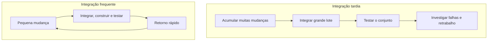
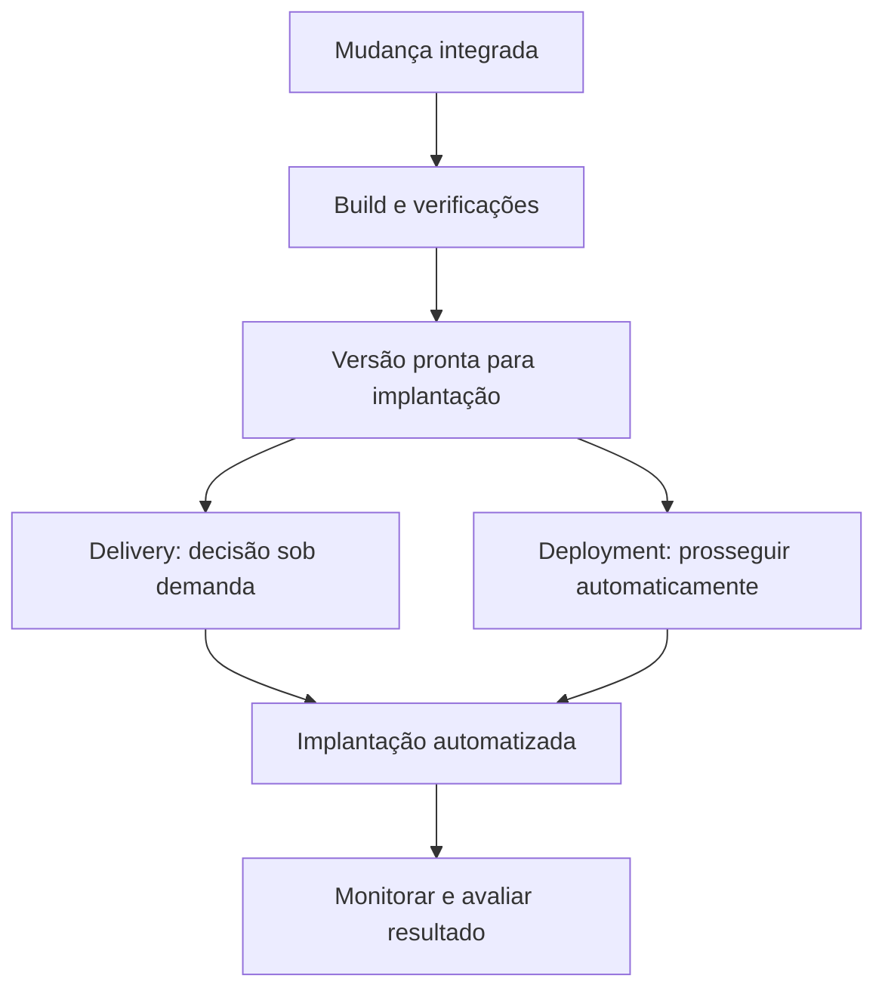

# Integração, entrega e implantação contínuas

- Criado em: 2026-09-15
- Última pesquisa: 2026-09-15

## Conceitos
| Prática | Objetivo | Característica |
|---|---|---|
| CI — Continuous Integration | Integrar mudanças pequenas e frequentes à linha principal | Build e testes automatizados dão retorno rápido |
| Continuous Delivery | Manter o software pronto para implantação sob demanda | A decisão de implantar em produção pode ser humana |
| Continuous Deployment | Implantar automaticamente mudanças que passam pelas verificações | Não há aprovação manual por mudança no fluxo de produção |

CI depende de integração frequente, não apenas de possuir uma ferramenta de build. Corrigir rapidamente uma integração quebrada evita acumular problemas. [DORA — Continuous integration](https://dora.dev/capabilities/continuous-integration/).

Continuous delivery é capacidade de entrega confiável sob demanda, e não simplesmente “deploy manual”. Uma aprovação humana pode acionar uma implantação automatizada. Continuous deployment acrescenta a implantação automática das mudanças aprovadas pelo fluxo. [DORA — Continuous delivery](https://dora.dev/capabilities/continuous-delivery/).

## Integração tardia e frequente
O diagrama compara frequência e tamanho dos lotes; não define Waterfall nem toda a cultura DevOps.

Mudanças pequenas facilitam localizar a origem de uma falha. Integração frequente não depende de esperar o final de uma sprint. [DORA — Continuous integration](https://dora.dev/capabilities/continuous-integration/).

## Entrega e implantação
Exemplo didático: ambas as rotas pressupõem verificações, inclusive as de segurança definidas para o projeto.

São alternativas de decisão após as verificações, não duas implantações obrigatórias. Uma falha impede prosseguir até seu tratamento. [DORA — Continuous delivery](https://dora.dev/capabilities/continuous-delivery/).

## Distinções importantes
- **Scrum e DevOps:** sprints pertencem ao Scrum; não definem DevOps. No Scrum, duram um mês ou menos, não obrigatoriamente duas semanas. [Scrum Guide](https://scrumguides.org/scrum-guide.html).
- **BDD e interface:** BDD apoia a descoberta e descrição colaborativa de comportamentos por exemplos; não é sinônimo de Selenium nem de teste visual. [Cucumber — BDD](https://cucumber.io/docs/bdd/).
- **CI e teste de integração:** CI é uma prática de integração do trabalho; teste de integração é um tipo de teste que pode participar do fluxo.
- **Waterfall e retrabalho:** uma falha não implica necessariamente reescrever toda a aplicação; o alcance da correção depende da causa e das partes afetadas.

## Exemplo ilustrativo
Uma alteração no login é integrada e verificada. Em delivery, a versão permanece pronta até a decisão de implantação; em deployment, o fluxo a implanta automaticamente se atender aos critérios. O exemplo não representa uma pipeline já configurada.

[[DevOps, DevSecOps e AppSec]] · [[Ciclo de desenvolvimento de software seguro — SSDLC]] · [[Verificações de segurança — SAST, DAST e SCA]]

## Automação com GitHub Actions

[[GitHub Actions — workflows, jobs e steps]] apresenta a estrutura para automatizar tarefas de CI/CD. [[GitHub Actions — variáveis, secrets e autenticação]] trata da configuração e das credenciais; [[GitHub Actions — agendamento com cron]] descreve tarefas periódicas. Essas notas contêm exemplos didáticos, sem implantação executada.

## Revisão técnica
2026-09-15 — Corrigidas as equivalências entre CI e passagem de ambientes, delivery e trabalho manual, BDD e interface. Diagramas reformulados como modelos didáticos.

## Referências
- [DORA — Continuous integration](https://dora.dev/capabilities/continuous-integration/) — consultado em 2026-09-15.
- [DORA — Continuous delivery](https://dora.dev/capabilities/continuous-delivery/) — consultado em 2026-09-15.
- [Cucumber — BDD](https://cucumber.io/docs/bdd/) — consultado em 2026-09-15.
- [Scrum Guide](https://scrumguides.org/scrum-guide.html) — consultado em 2026-09-15.

[[Índice — DevSecOps|Voltar ao índice]]

