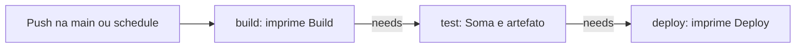

# Laboratório — GitHub Actions — jobs e eventos

- Registrado e pesquisado em: 2026-10-07
- Alterações analisadas: 2026-10-02 a 2026-10-07
- Situação: configuração identificada; execuções não confirmadas por logs.

## Pergunta do experimento

Como organizar jobs dependentes e acionar a automação por push e agendamento?

## Ambiente e evidências

Projeto pessoal de Ewerton: [devsecops-with-github-actions](https://github.com/carreiras/devsecops-with-github-actions). Checkout analisado: `C:\projetos\estudos\devsecops-with-github-actions`; snapshot `55fe6ed4fb8095ba4d82e0caacdb5dce7583a2e6`, de 2026-10-06. Arquivo: `.github/workflows/main.yaml`. Runner declarado: `ubuntu-latest`; imagem e versões efetivas não confirmadas por logs.

A evidência é o código e o histórico Git local. O acesso remoto não foi confirmado; os links não comprovam o estado atual do GitHub nem resultados de execução.

## Passos executados

Sequência das alterações comprovadas pelo histórico Git local. Ela não pressupõe que cada versão tenha sido executada com sucesso:

1. **2026-10-02 — `bc9ceaf`:** criado `.github/workflows/main.yaml` com gatilho de push na `main`. Inicialmente havia um único job `build`, contendo checkout e steps que imprimiam `Build`, `Test` e `Deploy`.
2. **2026-10-02 — `baf4334`:** separados os steps em três jobs, removido o checkout do job `build` e acrescentados `needs: build` em `test` e `needs: test` em `deploy`.
3. **2026-10-04 — `fabd189`:** acrescentado `schedule` com `'12 46 * * *'`. O segundo campo corresponde à hora; `46` está fora do intervalo 0–23. O diff comprova a configuração inválida, mas não há mensagem de execução registrada. [GitHub — sintaxe de schedule](https://docs.github.com/en/actions/reference/workflows-and-actions/events-that-trigger-workflows#schedule).
4. **2026-10-04 — `ecb25f2`:** corrigida a expressão para `'47 12 * * *'`, com minuto 47 e hora 12.
5. **2026-10-04 — `c29a42d`:** comentado o bloco `schedule` durante a alteração que acrescentou action e artefato ao job `test`.
6. **2026-10-06 — `47ae841`:** reativado o bloco `schedule`, mantendo `'47 12 * * *'`. Essa é a configuração presente no snapshot analisado.

**Não reconstruído:** comandos locais utilizados para editar ou enviar commits, tentativas intermediárias não commitadas, acionamentos remotos e resultados dos jobs. O histórico permite ordenar as alterações, não substituir logs de execução.

## Configuração identificada

Trecho do snapshot, com indentação normalizada para leitura; não é o workflow completo:

```yaml
on:
  schedule:
    - cron: '47 12 * * *'
  push:
    branches: [main]
```

Os três jobs usam `runs-on: ubuntu-latest`. `test` declara `needs: build`; `deploy` declara `needs: test`.



`build` e `deploy` usam apenas `echo`: não constroem nem implantam uma aplicação. O conteúdo de `test` está em [[Laboratório — GitHub Actions — action composta Soma]] e [[Laboratório — GitHub Actions — publicação de artefatos]].

## Evolução comprovada pelos commits

| Data | Commit | Mudança |
|---|---|---|
| 2026-10-02 | [bc9ceaf](https://github.com/carreiras/devsecops-with-github-actions/commit/bc9ceaf38a23fdf8f37972296637ff314572f04a) | Inclusão do workflow inicial |
| 2026-10-02 | [baf4334](https://github.com/carreiras/devsecops-with-github-actions/commit/baf433458d6eb1761f403c6bd6dff86319c7f4f1) | Evolução dos jobs de teste e deploy |
| 2026-10-04 | [fabd189](https://github.com/carreiras/devsecops-with-github-actions/commit/fabd1895a2a59bb83842a9a60f7a53399415d36d) | Inclusão de cron |
| 2026-10-04 | [ecb25f2](https://github.com/carreiras/devsecops-with-github-actions/commit/ecb25f229d795eca66fd95f5e50bd0ca11941727) | Ajuste da expressão cron |
| 2026-10-04 | [c29a42d](https://github.com/carreiras/devsecops-with-github-actions/commit/c29a42d43977ebffec44c9f126d754055be56ae9) | Desativação do bloco schedule por comentários |
| 2026-10-06 | [47ae841](https://github.com/carreiras/devsecops-with-github-actions/commit/47ae8411f5194004b59c2167b83e43c18d2247f9) | Reativação do schedule |

As mudanças estão no histórico; não reconstituem todos os comandos ou tentativas do usuário.

## Resultado esperado e observado

| Aspecto | Esperado conforme configuração | Observado na análise |
|---|---|---|
| Push | Acionar ao enviar mudanças para `main` | Gatilho presente; execução não confirmada |
| Cron | Solicitar execução diária às 12h47 UTC, equivalente a 9h47 em UTC−3 | Expressão presente, sem `timezone`; horário real não confirmado |
| Dependências | Prosseguir de `build` para `test` e depois `deploy`, conforme sucesso e condições padrão | `needs` presente; resultados não confirmados |

O schedule executa sobre a branch padrão e pode atrasar ou ter execuções descartadas sob carga. `needs` cria dependências; não implementa sozinho uma política de segurança. [GitHub — schedule](https://docs.github.com/en/actions/reference/workflows-and-actions/events-that-trigger-workflows#schedule), [sintaxe de jobs](https://docs.github.com/en/actions/reference/workflows-and-actions/workflow-syntax#jobs).

## Aprendizado e limites

O código demonstra eventos e dependências. Não comprova CI completa, deploy real ou bloqueio por vulnerabilidades. Não foram executados workflows nesta documentação.

## Evolução — execução de imagem em 2026-10-07

O snapshot de 2026-10-06 descrito acima está preservado como histórico. Novo snapshot local: `516504bccefaa9008748d5461f48c788a652a3dc`, de 2026-10-07.

**Passos executados, comprovados pelo Git:** no [commit 5960b914](https://github.com/carreiras/devsecops-with-github-actions/commit/5960b91465a11c4bcaa653ee1926a2cbfd359344), substituído `echo "Deploy"` no job `deploy` pelo comando abaixo. No [commit 516504bc](https://github.com/carreiras/devsecops-with-github-actions/commit/516504bccefaa9008748d5461f48c788a652a3dc), atualizado o README. Mantidos os eventos, `ubuntu-latest` e `needs: test`.

```yaml
deploy:
  runs-on: ubuntu-latest
  needs: test
  steps:
    - name: Deploy
      run: docker run ewertoncarreira/hello-docker
```

Fragmento do workflow, não um arquivo completo. A construção e publicação manual da imagem estão em [[Laboratório — Docker — construção, publicação e execução de imagem]]. O job `build` ainda imprime `Build`; a construção Docker não foi adicionada à pipeline.

**Esperado, inferido da configuração:** após sucesso de `test`, executar a referência `ewertoncarreira/hello-docker:latest` no runner e imprimir `Hi :)` se o conteúdo publicado corresponder ao script registrado. **Observado:** alteração do comando confirmada no diff local; nenhum log remoto disponível. Não houve erro de Actions ou solução registrada nesta etapa.

**Conclusão da análise:** execução de imagem substitui a mensagem simulada, mas não representa implantação de serviço. Sem tag explícita, usa `latest`; com a política padrão, baixa a imagem se ela estiver ausente. A referência não fixa o digest documentado na publicação. [Docker — execução](https://docs.docker.com/reference/cli/docker/container/run/), [tags e digests](https://docs.docker.com/reference/cli/docker/image/pull/). Ambiente efetivo e resultado do job permanecem pendentes.

## Evidências pendentes de execução

- [ ] Vincular execução por push, com commit, data e resultado de cada job.
- [ ] Vincular execução cujo evento seja `schedule` e registrar o horário observado.
- [ ] Se for realizado teste controlado de falha, registrar o job afetado e o tratamento dos dependentes.

## Referências e conexões

Documentação GitHub citada acima, consultada em 2026-10-07 e registrada em [[Referências DevSecOps]].

[[GitHub Actions — workflows, jobs e steps]] · [[GitHub Actions — agendamento com cron]] · [[Integração, entrega e implantação contínuas]]

[[Laboratório DevSecOps|Voltar ao laboratório]]
