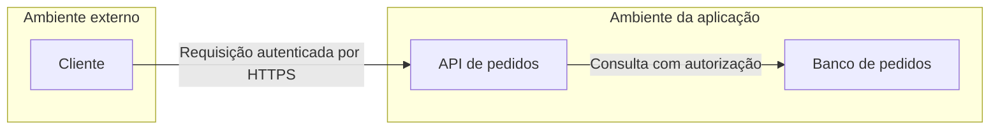

# Modelagem de ameaças e STRIDE

- Criado em: 2026-09-11
- Última pesquisa: 2026-09-11

## Conceito
Modelagem de ameaças é uma análise estruturada do sistema, das formas de abuso e das respostas possíveis. Deve acompanhar a evolução do sistema, começando cedo. Identificar tecnologias e portas é apenas parte do levantamento; fluxos de dados e fronteiras de confiança também importam. [OWASP — Modelagem de ameaças](https://cheatsheetseries.owasp.org/cheatsheets/Threat_Modeling_Cheat_Sheet.html).

## STRIDE
STRIDE organiza ameaças em seis categorias. Os exemplos são ilustrativos.
| Categoria | Significado | Exemplo |
|---|---|---|
| Spoofing | Falsificação de identidade | Usar credenciais de outra pessoa |
| Tampering | Alteração indevida | Manipular o valor de um pedido |
| Repudiation | Repúdio de uma ação | Não haver evidência confiável de uma operação |
| Information disclosure | Divulgação de informação | Ler pedidos de outro cliente |
| Denial of service | Negação de serviço | Esgotar recursos do serviço |
| Elevation of privilege | Elevação de privilégio | Conta comum executar função administrativa |

STRIDE auxilia a identificação; não é, por si só, uma pontuação de risco. [Microsoft — STRIDE](https://learn.microsoft.com/en-us/azure/security/develop/threat-modeling-tool-threats).

## Roteiro de análise
1. Delimitar o sistema e os dados que precisam de proteção.
2. Representar componentes, fluxos e fronteiras de confiança.
3. Identificar ameaças e priorizar respostas.
4. Definir controles e verificar se tratam as ameaças.
5. Rever o modelo quando o sistema mudar. [OWASP — Modelagem de ameaças](https://cheatsheetseries.owasp.org/cheatsheets/Threat_Modeling_Cheat_Sheet.html).

Exemplo ilustrativo simplificado:

Pergunta de análise: se o cliente alterar o identificador do pedido, a API verifica a propriedade antes de consultar ou retornar os dados? A resposta vira um [[Requisitos de segurança|requisito de segurança]] e um teste.

## Revisão técnica
2026-09-11 — Terminologia STRIDE conferida na documentação Microsoft; modelagem ampliada além de inventário de versões e portas.

[[Ciclo de desenvolvimento de software seguro — SSDLC]]

## Referências
- [Microsoft — STRIDE](https://learn.microsoft.com/en-us/azure/security/develop/threat-modeling-tool-threats) — consultado em 2026-09-11.
- [OWASP — Modelagem de ameaças](https://cheatsheetseries.owasp.org/cheatsheets/Threat_Modeling_Cheat_Sheet.html) — consultado em 2026-09-11.

[[Índice — DevSecOps|Voltar ao índice]]

