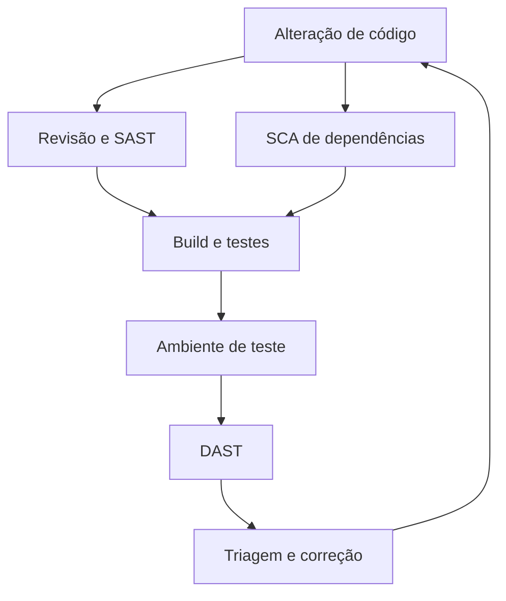

# Verificações de segurança — SAST, DAST e SCA

- Criado em: 2026-09-11
- Última pesquisa: 2026-10-07 (IaC; demais referências mantêm suas datas)

## Conceito
As técnicas são complementares e analisam objetos diferentes.

| Técnica | O que analisa | Limitação importante |
|---|---|---|
| SAST — Static Application Security Testing | Código ou representações estáticas, sem executar a aplicação alvo | Resultados dependem da linguagem, regras e análise; exigem triagem |
| DAST — Dynamic Application Security Testing | Aplicação em execução, por suas interfaces, incluindo APIs | Depende das rotas, estados e permissões alcançados |
| SCA — Software Composition Analysis | Componentes e dependências | Ausência de alerta não comprova ausência de vulnerabilidades |

SAST e DAST não devem ser tratados como nomes de produtos ou restritos a uma etapa final. [OWASP — Developer Guide](https://owasp.org/www-project-developer-guide/assets/exports/OWASP_Developer_Guide.pdf).

SCA pode relacionar componentes a vulnerabilidades publicadas. Por exemplo, Dependency-Check tenta identificar dependências e associá-las a registros conhecidos; essa identificação pode exigir avaliação dos resultados. [OWASP — Dependency-Check](https://owasp.org/www-project-dependency-check/).

## Fluxo ilustrativo de verificação



Esse fluxo não define uma configuração de GitHub Actions pronta. Mostra onde uma futura automação pode produzir evidências.

## Análise de infraestrutura como código — IaC

IaC descreve infraestrutura em arquivos. A análise estática desses arquivos pode identificar configurações inseguras antes da implantação. KICS utiliza regras chamadas queries para encontrar problemas de segurança e conformidade. Essa análise complementa SAST, SCA e DAST; não constitui uma verificação de dependências nem um teste dinâmico da aplicação. [Checkmarx — KICS](https://github.com/Checkmarx/kics).

### Exemplo 1 — usuário root no Dockerfile

**Contexto:** um serviço não precisa de privilégios administrativos para funcionar, mas seu Dockerfile termina com:

```dockerfile
USER root
CMD ["/app/servico"]
```

**Problema:** o processo inicia como root dentro do container. Isso amplia seus privilégios internos; não equivale, por si só, a usar `docker run --privileged` nem comprova acesso root ao host. O KICS documenta as queries `Last User Is 'root'` e `Missing User Instruction`. [KICS — queries de Dockerfile](https://docs.kics.io/latest/queries/dockerfile-queries/).

**Ajuste ilustrativo:** depois de criar o usuário `app` na imagem e conceder-lhe acesso aos arquivos necessários, substituir a instrução final por:

```dockerfile
USER app
CMD ["/app/servico"]
```

**Como conferir:** verificar o usuário efetivo do processo e testar leitura, escrita e inicialização com os privilégios necessários. A opção de execução `--user` pode substituir o usuário da imagem; por isso, revisar também a configuração de execução. Os trechos pressupõem `/app/servico` existente e executável; não são Dockerfiles completos. [Docker — USER](https://docs.docker.com/reference/dockerfile/#user).

### Exemplo 2 — bloqueio de acesso público de um bucket S3 em Terraform

**Contexto:** um bucket deve armazenar documentos privados. O recurso Terraform `aws_s3_bucket_public_access_block` permite controlar quatro proteções contra acesso público. Omiti-las ou defini-las como `false` exige investigação; isso sozinho não prova que os objetos estejam públicos, pois a proteção efetiva também depende de outros níveis e das políticas de acesso. [AWS — Block Public Access](https://docs.aws.amazon.com/AmazonS3/latest/userguide/access-control-block-public-access.html).

**Configuração proposta para esse contexto:** o fragmento pressupõe que `aws_s3_bucket.documentos` esteja declarado e que o provider AWS esteja configurado:

```hcl
resource "aws_s3_bucket_public_access_block" "documentos" {
  bucket = aws_s3_bucket.documentos.id

  block_public_acls       = true
  ignore_public_acls      = true
  block_public_policy     = true
  restrict_public_buckets = true
}
```

`block_public_acls` rejeita novas ACLs públicas; `ignore_public_acls` desconsidera concessões públicas por ACL; `block_public_policy` rejeita novas políticas públicas; `restrict_public_buckets` restringe acesso quando há política pública. [HashiCorp — recurso e argumentos](https://github.com/hashicorp/terraform-provider-aws/blob/main/website/docs/r/s3_bucket_public_access_block.html.markdown).

**Como conferir:** revisar o plano Terraform, as políticas do bucket e os bloqueios efetivos na AWS, inclusive no nível da conta. Testar em ambiente autorizado que acesso anônimo é negado e que o acesso legítimo continua funcionando. Este controle não configura criptografia, auditoria ou todas as permissões. [AWS — Block Public Access](https://docs.aws.amazon.com/AmazonS3/latest/userguide/access-control-block-public-access.html).

O KICS documenta queries como `S3 Bucket Without Ignore Public ACL` e `S3 Bucket Without Restriction Of Public Bucket`. A presença dessas regras não significa que um scan tenha sido realizado ou que detectará toda exposição. [KICS — queries de Terraform](https://docs.kics.io/latest/queries/terraform-queries/).

**Limite comum aos dois exemplos:** o scanner examina arquivos conforme formatos, queries e versão. O ambiente pode ter sido alterado por outro meio ou estar executando um artefato diferente. É necessário conferir o estado efetivo. Os exemplos não foram executados e não representam configurações do usuário.

As ferramentas e suas limitações estão em [[Ferramentas de segurança na pipeline]].

## Outros testes
Revisão de código e pentest acrescentam análise humana e investigação de cenários. Nenhuma técnica isolada garante segurança. Testes devem estar ligados a requisitos e riscos. [OWASP — Developer Guide](https://owasp.org/www-project-developer-guide/assets/exports/OWASP_Developer_Guide.pdf).

Um teste que usa um endpoint real e banco pode ser de integração ou ponta a ponta, dependendo do escopo; não deve ser chamado automaticamente de unitário apenas por verificar login.

## Dependências
Atualizações precisam de avaliação e testes de compatibilidade. Adiar indefinidamente também mantém exposição a falhas conhecidas. A decisão deve considerar a vulnerabilidade identificada e o uso do componente, em vez de apenas contar alertas. [OWASP — Dependency-Check](https://owasp.org/www-project-dependency-check/).

## Triagem de alertas
Um alerta precisa ser investigado antes de concluir que há uma falha ou descartá-lo.

| Situação | Interpretação e tratamento |
|---|---|
| Falso positivo | A condição apontada não corresponde ao problema real; registrar evidência e justificativa |
| Falha confirmada com exposição limitada | A falha existe; avaliar prioridade considerando impacto e possibilidade de exploração |
| Alerta em código de teste | Verificar se os dados são fictícios, se há credenciais válidas e quais ambientes são alcançáveis |
| Decisão de não corrigir agora | Documentar motivo, responsável e condição de reavaliação; não chamar de falso positivo apenas por aceitar o risco |

Ter poucos usuários ou estar fora de produção não prova que o alerta seja falso. O GitHub distingue motivos de descarte, incluindo falso positivo e uso em testes; o motivo deve refletir a análise realizada. [GitHub — triagem de alertas](https://docs.github.com/en/code-security/how-tos/manage-security-alerts/manage-code-scanning-alerts/triage-alerts-in-pull-requests).

Roteiro sugerido: entender o alerta, conferir o fluxo afetado, avaliar o contexto, escolher o tratamento e verificar a correção. Exemplos: uma string fictícia confundida com senha pode ser falso positivo; uma credencial válida em um teste exige tratamento. A tabela é uma orientação de análise, não autorização automática de descarte.

[[DevOps, DevSecOps e AppSec]] · [[Integração, entrega e implantação contínuas]]

## Revisão técnica
2026-10-07 — Desenvolvidos exemplos de usuário root em Dockerfile e bloqueio de acesso público S3 em Terraform, com contexto, ajuste, critérios de verificação e limites. Fontes Docker, KICS, AWS e HashiCorp citadas junto aos exemplos; não houve execução.

2026-10-07 — Acrescentada análise de IaC e sua distinção de SCA e DAST, conforme o projeto KICS. Nenhum scanner foi executado.

2026-09-15 — Acrescentada distinção entre falso positivo, contexto de risco e decisão de tratamento. Fonte: documentação GitHub citada na seção de triagem.

2026-09-11 — Corrigida a mistura entre SAST, DAST e SCA. DAST não se limita à interface visual. Nenhuma execução de scanner foi realizada nesta etapa.

[[Requisitos de segurança]] · [[Hardening e operação segura]]

## Referências
- [Docker — USER](https://docs.docker.com/reference/dockerfile/#user) — consultado em 2026-10-07.
- [KICS — queries de Dockerfile](https://docs.kics.io/latest/queries/dockerfile-queries/) — consultado em 2026-10-07.
- [KICS — queries de Terraform](https://docs.kics.io/latest/queries/terraform-queries/) — consultado em 2026-10-07.
- [AWS — Block Public Access](https://docs.aws.amazon.com/AmazonS3/latest/userguide/access-control-block-public-access.html) — consultado em 2026-10-07.
- [HashiCorp — s3_bucket_public_access_block](https://github.com/hashicorp/terraform-provider-aws/blob/main/website/docs/r/s3_bucket_public_access_block.html.markdown) — consultado em 2026-10-07 pela documentação bruta oficial.
- [Checkmarx — KICS](https://github.com/Checkmarx/kics) — consultado em 2026-10-07.
- [GitHub — triagem de alertas](https://docs.github.com/en/code-security/how-tos/manage-security-alerts/manage-code-scanning-alerts/triage-alerts-in-pull-requests) — consultado em 2026-09-15.
- [OWASP — Developer Guide](https://owasp.org/www-project-developer-guide/assets/exports/OWASP_Developer_Guide.pdf) — consultado em 2026-09-11.
- [OWASP — Dependency-Check](https://owasp.org/www-project-dependency-check/) — consultado em 2026-09-11.

[[Índice — DevSecOps|Voltar ao índice]]
